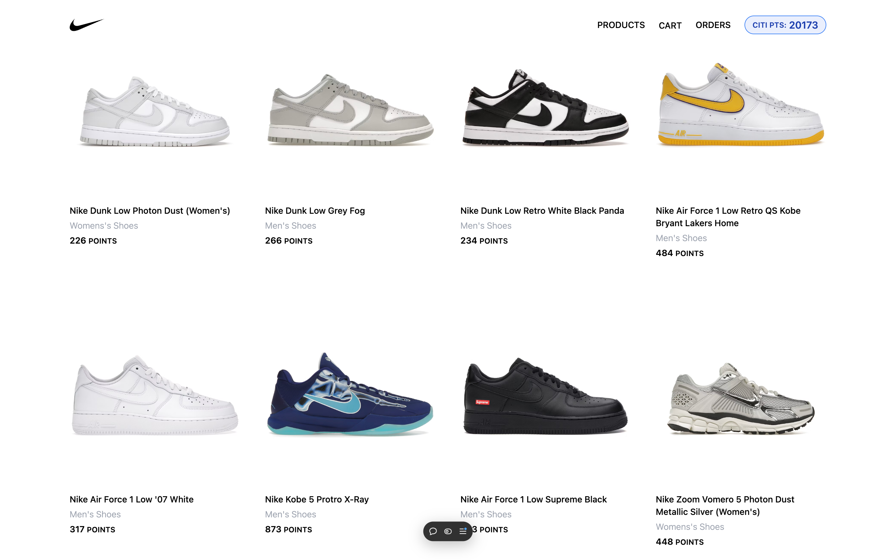
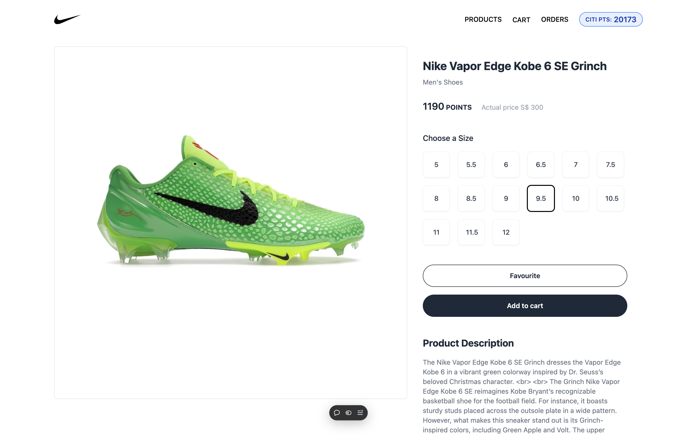
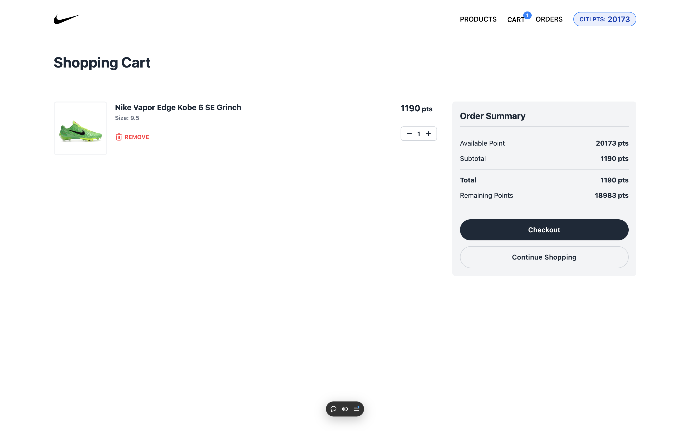
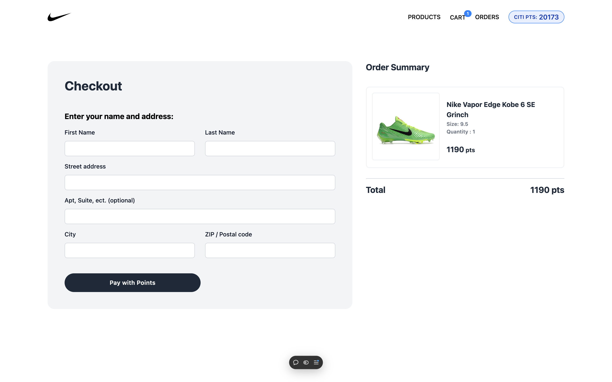
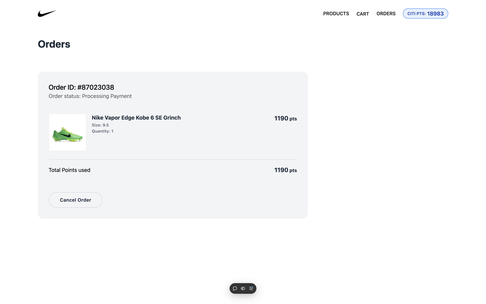

# Pay with Reward Points!

## Project Description

### Overview

The Citi Reward Points Shopping Integration project allows users to leverage the reward points accumulated on their Citi credit card to pay for purchases on partner websites. This innovative solution provides a seamless and convenient shopping experience, where customers can directly use their points as a payment method without the need for additional conversions or complex processes. In this project, Nike online shopping platform is use as a Citi's partner platform to demonstrate Citi Reward Points Shopping Integration.  

#### Key Features:

-   **Points-Based Payment**: Customers can select the option to pay using their Citi credit card reward points at participating partner retailers' websites.
-   **Seamless Checkout Experience**: The integration ensures a smooth, frictionless experience, allowing users to apply their reward points during the checkout process with minimal effort.
-   **Instant Redemption**: Users can view and apply their accumulated points in real-time, with the system automatically calculating the points available for use based on the transaction amount.
-   **Enhanced Customer Loyalty (Future enhancement)**: By offering more value and convenience to customers, this feature strengthens brand loyalty and enhances the overall Citi rewards program.

#### Objective:

The primary objective of this project is to enrich the customer experience by offering an alternative, easy-to-use payment method, fostering greater engagement with Citi's reward program, and expanding the utility of the reward points. It also aims to increase customer satisfaction and improve the conversion rate for participating merchants.

By removing barriers to using reward points, this integration ensures that customers can shop with greater ease and feel the tangible value of their accumulated rewards across a wide range of partner sites.

### User Stories

The application is designed to meet the following user needs:

-   **As a user**, I want to be able to see my balance rewards points.
-   **As a user**, I want to be able to use my points to pay for products.
-   **As a user**, I want the app to be track my orders.
-   **As a user**, I want to cancel my order and get points refunded. 

## Live Demo

[pay-with-points.vercel.app](https://pay-with-points.vercel.app/)

## Screenshots 
#### All Products page

#### Product details page

#### Cart page

#### Checkout page

#### Orders page

## Technologies Used

This project is built with the following technologies:

### Frontend
- React.js with Vite
- React Router for navigation 
- React-infinite-scroll-component
- Tailwind CSS 

### Backend & APIs
- Citi Partners APIs - Retrieve Points & Process Redemption    
- Sneaker API - Product Listing
- Airtable - Process Checkout and Tracking Orders  

### Deployment 
- Vercel

## Planned future enhancements

- User authorisation
- Stripe payment mode (Points + card payment)
- Convert rewards points to partner points (eg. Citi Points to Nike Points)
  

## Attributions

 Tailwind components - readymadeui.com & tailwindui.com
 